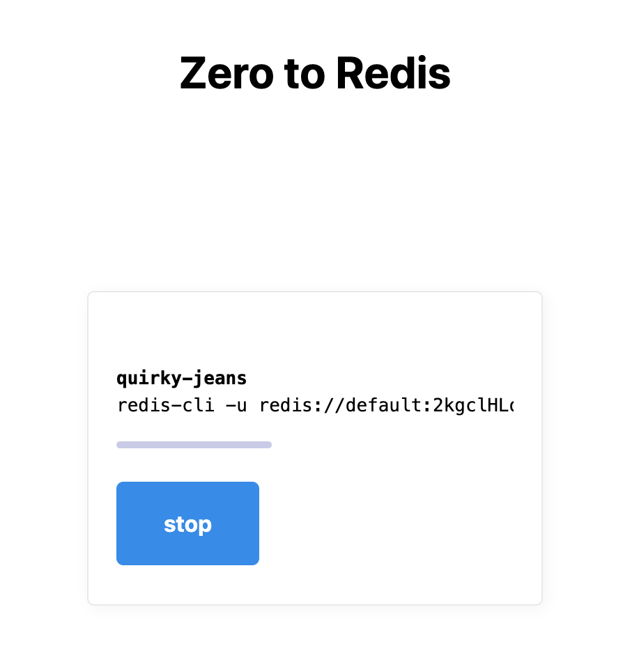

# Zero to Redis

What if you could start a Redis instance in less than 10 seconds? Well, now you can!



Zero To Redis uses the [Railway hosting plaform](https://railway.app/) to spin up a Redis server. It gives you a `redis://` URL to connect to the new server.

# Guiding Principles

Zero To Redis is written in a style that combines a pragmatic approach (which lets you get stuff done quickly) with a focus on code quality (which helps you avoid slowing down due to technical debt after a few months).

Some guiding principles used:

- Testing: backend logic is tested using VCR technique (fast isolated unit tests)
- Minimalist dependencies: use node test framework, express and parcel
- Simplicity: use state machine to simplify frontend code

# Usage

```
cd projects/backend
npm ci
export RAILWAY_API_TOKEN=YOUR_TOKEN
npm start
```

```
cd projects/frontend
npm ci
npm start
```

```
open http://localhost:1234/
```

# Tests

To show an approach to automated testing, the backend project contains a comprehensive test suite covering all external HTTP calls.

```
cd projects/backend
npm ci
npm test
```
